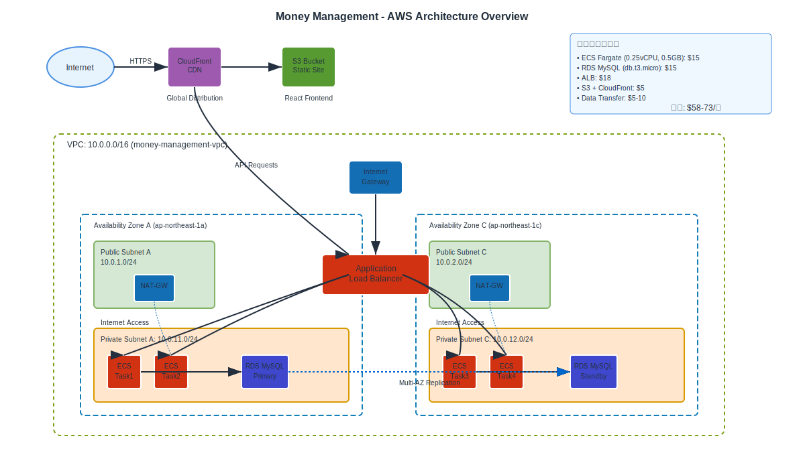
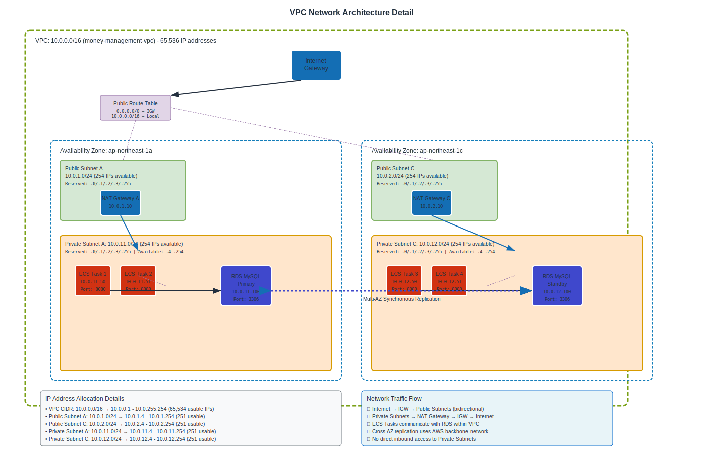

# VPC設計解説

## VPCとは？

**VPC (Virtual Private Cloud)** は、AWS上にあなた専用の仮想ネットワーク環境を作るサービスです。

### 身近な例で説明
- **物理世界**: 会社のオフィスビル → 各部屋に機器を配置 → LANケーブルで接続
- **AWS**: VPC → サブネット → EC2/RDS等のリソース → ネットワークで接続

### VPCの役割
1. **隔離**: 他のAWSユーザーから完全に分離された専用ネットワーク
2. **セキュリティ**: 誰がアクセスできるかを細かく制御
3. **通信制御**: インターネット接続や内部通信のルールを設定

## アーキテクチャ概要図



*AWS公式アイコンを使用した全体アーキテクチャ図*

## VPCネットワーク詳細図



*IPアドレス設計とルートテーブル構成を含む詳細ネットワーク図*

## セキュリティグループ構成図


*多層防御によるトラフィック制御とセキュリティルール*

---

**編集可能なソースファイル**: 
- [architecture-overview.drawio](assets/images/architecture-overview.drawio) 
- [vpc-network-detail.drawio](assets/images/vpc-network-detail.drawio)
- [security-groups.drawio](assets/images/security-groups.drawio)

## 設計の理由

### なぜこの構成？
- **Public Subnet**: インターネットからのアクセスを受け付けるALBを配置
- **Private Subnet**: 外部から直接アクセスできない安全な場所にアプリとDBを配置
- **セキュリティ**: データベースは外部から完全に隔離、アプリ経由でのみアクセス

### セキュリティの多層防御
1. **インターネット → ALB**: HTTPSのみ許可
2. **ALB → ECS**: 内部通信のみ
3. **ECS → RDS**: MySQL接続のみ
4. **外部 → RDS**: 完全にブロック

## IPアドレス設計

### CIDR設計
- **VPC**: `10.0.0.0/16` (約65,000個のIPアドレス)
- **Public Subnet**: `10.0.1.0/24` (約250個)
- **Private Subnet**: `10.0.11.0/24` (約250個)

### なぜこの範囲？
- **10.0.x.x**: プライベートIPアドレス範囲（RFC1918準拠）
- **/16**: 将来の拡張性を考慮した十分な範囲
- **/24**: サブネット内での適切なホスト数

## セキュリティグループ設定

### 1. ALB用セキュリティグループ
```
インバウンド:
- HTTPS (443): 0.0.0.0/0 (全世界から)
- HTTP (80): 0.0.0.0/0 (HTTPS リダイレクト用)

アウトバウンド:
- ECS Security Group: 8080 (アプリポート)
```

### 2. ECS用セキュリティグループ
```
インバウンド:
- Port 8080: ALB Security Groupから

アウトバウンド:
- HTTPS (443): 0.0.0.0/0 (外部API呼び出し用)
- MySQL (3306): RDS Security Groupへ
```

### 3. RDS用セキュリティグループ
```
インバウンド:
- MySQL (3306): ECS Security Groupから

アウトバウンド:
- なし
```

## Multi-AZ設計

### 可用性の向上
```
AZ-1a                    AZ-1c
├─ Public Subnet        ├─ Public Subnet
│  └─ ALB (Primary)     │  └─ ALB (Secondary)
├─ Private Subnet       ├─ Private Subnet  
│  ├─ ECS Task          │  ├─ ECS Task
│  └─ RDS Primary       │  └─ RDS Standby
```

### 災害対策
- **RDS Multi-AZ**: 自動フェイルオーバー
- **ALB**: 複数AZに分散
- **ECS**: 複数AZでタスク実行

## ベストプラクティス

### セキュリティ
1. **最小権限の原則**: 必要最小限のポート・プロトコルのみ許可
2. **Defense in Depth**: 多層のセキュリティ制御
3. **Network ACLs**: サブネットレベルでの追加制御

### 運用性
1. **VPC Flow Logs**: ネットワークトラフィックの監視
2. **CloudTrail**: API呼び出しのログ記録
3. **Config Rules**: コンプライアンス監査

### コスト最適化
1. **NAT Gateway**: 必要最小限のデータ転送
2. **EIP**: 使用していないElastic IPの削除
3. **Data Transfer**: 同一AZ内通信の活用

---

[← トップページに戻る](index.html)